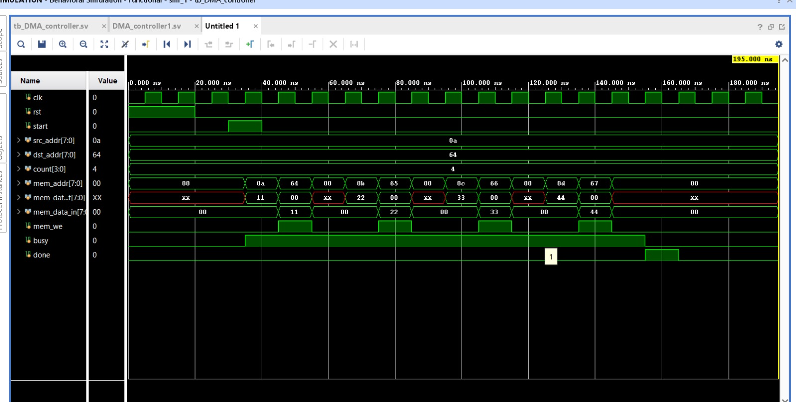

# DMA Controller (Verilog/SystemVerilog)

## Overview

This project implements a Direct Memory Access (DMA) Controller using Verilog/SystemVerilog. The controller transfers data directly from a source memory location to a destination memory location without continuous CPU intervention, improving the efficiency of data movement in embedded and computer systems.

The design has been functionally verified using Xilinx Vivado Simulator.

---

## Features

- Finite State Machine (FSM) based DMA Controller
- Memory-to-Memory data transfer
- Configurable Source Address
- Configurable Destination Address
- Configurable Transfer Count
- Busy and Done status signals
- Parameterized Memory Module
- Functional verification using SystemVerilog Testbench

---

## Project Files

| File | Description |
|------|-------------|
| DMA_controller1.sv | Main DMA Controller implementing the FSM |
| Source_register.sv | Stores the source address |
| destination1_register.sv | Stores the destination address |
| control_register.sv | Stores control information |
| count1_register.sv | Stores transfer count |
| memory.sv | Parameterized memory module |
| tb_DMA_controller.sv | SystemVerilog Testbench |
| waveform.jpeg | Simulation waveform |

---

## DMA Controller Operation

The DMA Controller operates using the following FSM.

```
          +------+
          | IDLE |
          +------+
              |
              v
          +------+
          | READ |
          +------+
              |
              v
          +-------+
          | WRITE |
          +-------+
              |
              v
         +---------+
         | UPDATE  |
         +---------+
              |
      Count > 0 ?
        /       \
      Yes        No
       |          |
       |          v
       |      +------+
       +----> | DONE |
              +------+
```

---

## State Description

### IDLE
Waits for the **start** signal.

### READ
Reads data from the source memory address.

### WRITE
Writes the data into the destination memory location.

### UPDATE
- Increments source address
- Increments destination address
- Decrements transfer count

### DONE
Asserts the **done** signal indicating successful completion of the transfer.

---

## Simulation Result

The waveform below demonstrates successful DMA operation.

- Source Address = **0x0A**
- Destination Address = **0x64**
- Transfer Count = **4**
- Data transferred = **11, 22, 33, 44**
- **busy** remains high during transfer
- **done** is asserted after completion



---

## Tools Used

- Verilog
- SystemVerilog
- Xilinx Vivado 2025.1

---

## Applications

- Embedded Systems
- Computer Architecture
- High-Speed Data Transfer
- SoC Design
- FPGA Prototyping

---

## Future Improvements

- Burst Transfer Support
- Multiple DMA Channels
- Interrupt Generation
- AXI Bus Interface
- Priority-Based Arbitration

---

## Author

**Aditya Agarwal**

Electronics and Communication Engineering

Thapar Institute of Engineering and Technology
